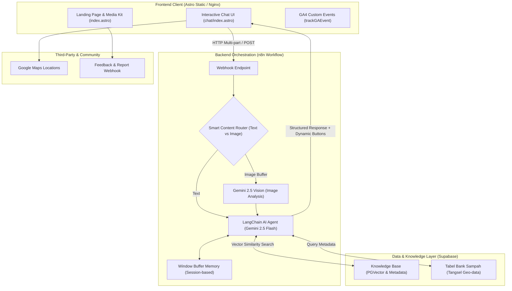
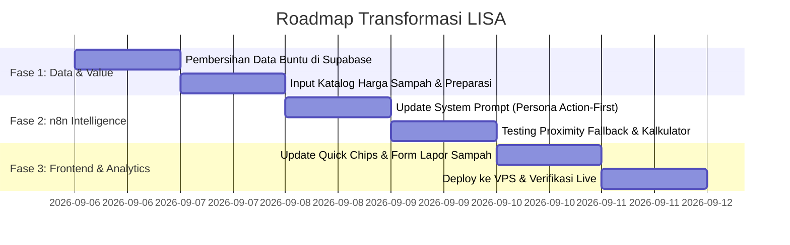

# 🌿 Blueprint Transformasi LISA: Dari Chatbot Top-Down Menjadi Action-Driven Eco-Assistant

Dokumen ini memuat analisis arsitektur, strategi transformasi, dan rencana implementasi (*action plan*) untuk mengubah **LISA (Lingkungan Sehat dan Asri)** dari sekadar chatbot edukasi pasif (*top-down Q&A*) menjadi platform penyelesaian masalah lingkungan yang nyata, berbasis aksi (*bottom-up*), berinsentif ekonomi, dan relevan bagi siswa/komunitas.

---

## 1. 🏗️ Arsitektur Sistem Saat Ini (Existing Stack)

LISA beroperasi dengan arsitektur *serverless/microservices-hybrid*:



---

## 2. 🔍 Diagnosis Masalah: Mengapa Desain Lama "Top-Down & Cetek"?

1. **Jalan Buntu (*Dead-End UX*) pada Data Geografis**:
   - Terdapat record di Supabase dengan status *"Belum Ada Bank Sampah"* untuk kelurahan tertentu. Bot hanya menyampaikan informasi ketiadaan tanpa memberikan solusi titik terdekat alternatif.
2. **Ketiadaan *Economic Incentive* (Faktor Pemicu Aksi)**:
   - Pengguna hanya diberi tahu *"ini sampah anorganik, daur ulanglah"*. Tidak ada taksiran nilai ekonomis (harga per kg) atau nilai tabungan sampah yang bisa memotivasi siswa untuk mulai mengumpulkan dan menyetor.
3. **Komunikasi Monolog vs Aksi Nyata**:
   - Edukasi berbentuk paragraf penjelasan panjang, bukan instruksi preparasi sampah (misal: *"lepas label, bilas, remas/gepengkan"*).
4. **Pelaporan yang Pasif**:
   - Form masukan hanya menampung feedback aplikasi, belum menjadi kanal pelaporan masalah lingkungan riil (seperti tumpukan sampah liar di sekitar sekolah).

---

## 3. 🎯 Pilar Transformasi Baru (Bottom-Up & Action-Driven)

```
       [ 1. ACCURACY & PROXIMITY ]
       • Fallback radius terdekat untuk daerah tanpa bank sampah
       • Verifikasi jadwal timbang & kontak WhatsApp pengurus
                   │
                   ▼
       [ 2. ECONOMIC & VALUE LAYER ]
       • Katalog harga/kg sampah (PET, Kardus, Jelantah, Kaleng)
       • Kalkulator potensi cuan & reduksi karbon (CO2)
                   │
                   ▼
       [ 3. STEP-BY-STEP PREPARATION ]
       • Panduan preparasi sampah sebelum disetor (Cuci-Kering-Gepeng)
       • Decision Tree: Daur Ulang Mandiri (DIY) vs Jual ke Bank Sampah
                   │
                   ▼
       [ 4. CLOSED-LOOP COMMUNITY REPORTING ]
       • Fitur Lapor Tumpukan Sampah Liar via Foto + Lokasi
```

---

## 4. 📐 Detail Perubahan Spesifikasi Arsitektur

### 4.1. Layer Supabase (Knowledge Base & Database Schema)

#### A. Katalog Harga & Taksiran Sampah (`waste_valuation_catalog`)
Menambahkan referensi harga riil per kategori sampah di wilayah Tangerang Selatan & sekitarnya:

| Kategori Sampah | Sub-jenis | Kisaran Harga/Kg | Tips Preparasi Khusus |
| :--- | :--- | :--- | :--- |
| **Plastik** | Botol PET Bening (Air Mineral) | Rp 3.000 – Rp 4.500 | Lepas tutup & label plastik, remas hingga pipih |
| **Plastik** | Tutup Botol (HDPE) | Rp 2.500 – Rp 3.500 | Kumpulkan terpisah dari botol |
| **Plastik** | Emberan / Plastik Keras | Rp 1.500 – Rp 2.500 | Bersihkan dari sisa semen/cat |
| **Kertas** | Kardus / Box Cokelat | Rp 1.500 – Rp 2.200 | Lipat rapi, ikat dengan tali, pastikan kering |
| **Kertas** | Buku Tulis / Kertas HVS | Rp 1.200 – Rp 2.000 | Pisahkan dari sampul plastik/spiral kawat |
| **Logam** | Kaleng Minuman (Aluminium) | Rp 10.000 – Rp 14.000 | Bersihkan sisa minuman, injak hingga gepeng |
| **Minyak** | Minyak Jelantah (UCO) | Rp 5.000 – Rp 7.000/liter | Saring remah makanan, tampung di jeriken/botol |

#### B. Transformasi Data Bank Sampah (Proximity Fallback)
1. **Hapus seluruh entri "belum_ada" statis**.
2. **Tambahkan Cluster / Kecamatan Radius**:
   - Jika user menyebut kelurahan *Sawah Baru* (Kec. Ciputat), AI otomatis mencari Bank Sampah terdekat di cluster Ciputat (misal: *Bank Sampah Teratai* di Jombang atau *Bank Sampah Kasih Ibu*).
   - Format respon:
     > *"Di kelurahan Sawah Baru belum ada unit aktif, tapi yang **paling dekat dari kamu** adalah **Bank Sampah Teratai (Jombang)** (±1.8 KM). Buka setiap Sabtu-Minggu. Mau aku buatkan rute Google Maps-nya?"*

---

### 4.2. Layer Orchestration n8n (System Prompt & Agent Logic)

Perubahan persona dan instruksi AI LISA pada node *System Prompt*:

1. **Prinsip "Action First, Explain Later"**:
   - Format jawaban ketika mengidentifikasi sampah:
     1. **Identifikasi & Klasifikasi Singkat** (1 kalimat).
     2. **Taksiran Nilai & Preparasi** (Langkah cuci/gepengkan + estimasi harga/kg).
     3. **Pilihan Aksi (Interactive Buttons)**:
        - `[BUTTONS:Jual ke Bank Sampah|bank sampah terdekat,Tutorial Daur Ulang DIY|cara daur ulang ini]`
2. **Kalkulator Tabungan Sampah Otomatis**:
   - Jika user menyebutkan kuantitas (misal: *"aku punya 5 kardus mie instan dan 20 botol le minerale"*), bot menghitung estimasi berat, potensi uang saku, dan dampak lingkungan ($CO_2$ yang dicegah mencemari TPA Cipeucang).

---

### 4.3. Layer Frontend (Astro + Vanilla JS)

1. **Quick Action "Cek Harga Sampah" & "Kalkulator Cuan"**:
   - Menambahkan tombol cepat pada `quickChipsBar` di `/chat`:
     - `💰 Cek Harga Sampah`
     - `📍 Bank Sampah Terdekat`
     - `📸 Scan Foto Sampah`
     - `🚨 Lapor Titik Sampah`
2. **Interactive Form: Pelaporan Titik Sampah Liar**:
   - Mengubah modal formulir menjadi formulir laporan berbasis foto + catatan lokasi untuk diteruskan ke database / Google Sheets tim relawan.

---

## 5. 🗓️ Rencana Eksekusi (Step-by-Step Implementation Plan)



---

## 6. 📈 Indikator Keberhasilan (Success Metrics)

1. **Conversion to Real Action**:
   - Peningkatan klik pada link Google Maps Bank Sampah (`action_maps_click`) > 25% dari total sesi.
2. **Vision Engagement**:
   - Penggunaan scan sampah berbasis foto (`image_attached`) meningkat karena adanya taksiran harga & langkah preparasi.
3. **User Retention**:
   - Siswa kembali menggunakan bot bukan hanya saat ada tugas sekolah, melainkan saat ingin menimbang dan menjual sampah tabungan mereka.
