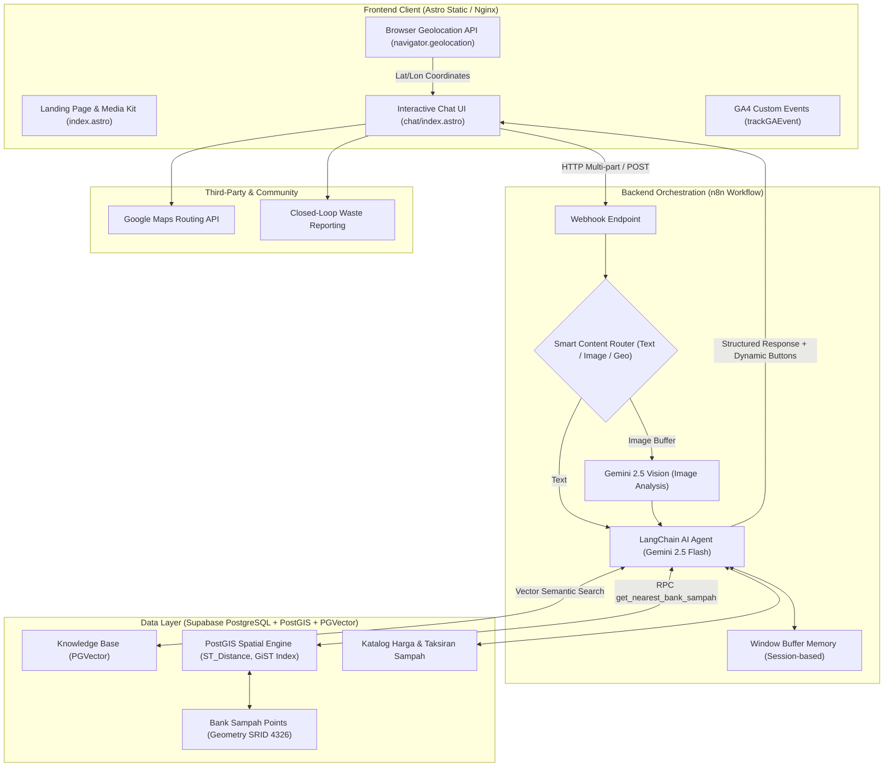
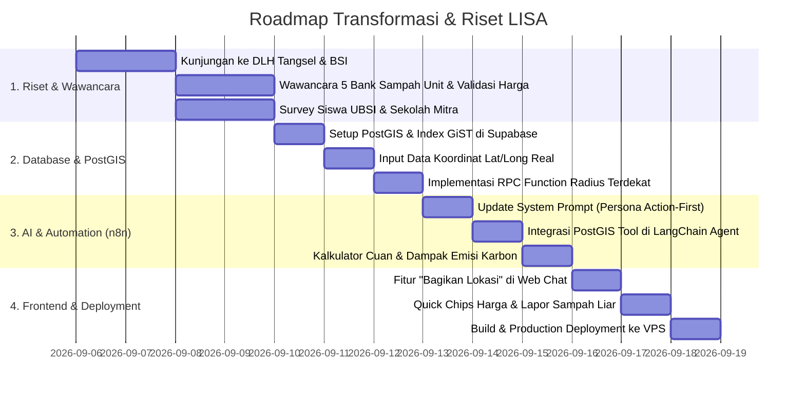

# 🌿 Blueprint Transformasi LISA: Dari Chatbot Top-Down Menjadi Action-Driven Eco-Assistant

Dokumen ini memuat analisis arsitektur, strategi transformasi teknologi spasial (PostGIS), protokol riset kualitatif/validasi data lapangan, dan rencana implementasi (*action plan*) untuk mengubah **LISA (Lingkungan Sehat dan Asri)** dari sekadar chatbot edukasi pasif (*top-down Q&A*) menjadi platform penyelesaian masalah lingkungan yang nyata, berbasis aksi (*bottom-up*), berinsentif ekonomi, dan relevan bagi siswa/komunitas.

---

## 1. 🏗️ Arsitektur Sistem Saat Ini & Target Transformasi

LISA beroperasi dengan arsitektur *serverless/microservices-hybrid* yang diperkaya oleh mesin spasial **PostgreSQL PostGIS**:



---

## 2. 🔍 Diagnosis Masalah: Mengapa Desain Lama "Top-Down & Cetek"?

1. **Jalan Buntu (*Dead-End UX*) pada Data Geografis**:
   - Terdapat record di Supabase dengan status *"Belum Ada Bank Sampah"* untuk kelurahan tertentu. Bot hanya menyampaikan informasi ketiadaan tanpa memberikan solusi titik terdekat alternatif.
2. **Ketiadaan *Economic Incentive* (Faktor Pemicu Aksi)**:
   - Pengguna hanya diberi tahu *"ini sampah anorganik, daur ulanglah"*. Tidak ada taksiran nilai ekonomis (harga per kg) atau nilai tabungan sampah yang bisa memotivasi siswa untuk mulai mengumpulkan dan menyetor.
3. **Komunikasi Monolog vs Aksi Nyata**:
   - Edukasi berbentuk paragraf penjelasan panjang, bukan instruksi preparasi sampah (misal: *"lepas label, bilas, remas/gepengkan"*).
4. **Data Lapangan Belum Tervalidasi (*Cold Data Gap*)**:
   - Jam buka bank sampah di database masih berupa teks statis (`08.00-16.00`) yang seringkali tidak akurat di lapangan (banyak bank sampah komunitas hanya buka saat hari penimbangan bulanan/mingguan).

---

## 3. 🎯 5 Pilar Transformasi Baru (Bottom-Up & Action-Driven)

```
       [ 1. POSTGIS SPATIAL PROXIMITY ENGINE ]
       • Pencarian radius terdekat (KNN <->) tanpa jalan buntu
       • Dukungan fitur "Bagikan Lokasi Saya" (1-Click Find Nearest)
                   │
                   ▼
       [ 2. ECONOMIC INCENTIVE & VALUATION LAYER ]
       • Katalog harga/kg sampah riil (PET, Kardus, Jelantah, Kaleng)
       • Kalkulator tabungan sampah & reduksi jejak karbon (CO2)
                   │
                   ▼
       [ 3. STEP-BY-STEP PREPARATION & DECISION TREE ]
       • Panduan preparasi sampah sebelum setor (Cuci-Kering-Gepeng)
       • Decision Tree: Daur Ulang Mandiri (DIY) vs Jual ke Bank Sampah
                   │
                   ▼
       [ 4. FIELD RESEARCH & STAKEHOLDER VALIDATION ]
       • Wawancara langsung & survei lapangan ke pengurus Bank Sampah / DLH
       • Verifikasi jadwal penimbangan asli & nomor kontak WhatsApp pengurus
                   │
                   ▼
       [ 5. CLOSED-LOOP COMMUNITY REPORTING ]
       • Fitur Lapor Tumpukan Sampah Liar via Foto + Koordinat GPS
```

---

## 4. 📐 Detail Arsitektur Spasial: PostgreSQL PostGIS Integration

### 4.1. Migrasi Skema Spasial di Supabase

```sql
-- 1. Aktifkan Ekstensi PostGIS
CREATE EXTENSION IF NOT EXISTS postgis;

-- 2. Tambah Kolom Geography pada Knowledge Base / Bank Sampah
ALTER TABLE knowledge_base 
ADD COLUMN IF NOT EXISTS location GEOGRAPHY(Point, 4326);

-- 3. Buat Index Spasial GiST untuk Pencarian Super Cepat (<2ms)
CREATE INDEX IF NOT EXISTS idx_knowledge_base_location 
ON knowledge_base USING GIST(location);

-- 4. Fungsi Pencarian Bank Sampah Terdekat (RPC Function)
CREATE OR REPLACE FUNCTION get_nearest_bank_sampah(
  user_lat FLOAT,
  user_lon FLOAT,
  max_distance_meters INT DEFAULT 7000,
  limit_count INT DEFAULT 3
)
RETURNS TABLE (
  id BIGINT,
  nama_bank_sampah TEXT,
  alamat_maps TEXT,
  jam_operasional TEXT,
  jadwal_penimbangan TEXT,
  kontak_wa TEXT,
  jenis_sampah TEXT,
  jarak_km NUMERIC
) LANGUAGE sql STABLE AS $$
  SELECT 
    id,
    title AS nama_bank_sampah,
    metadata->>'alamat' AS alamat_maps,
    metadata->>'jam_operasional' AS jam_operasional,
    metadata->>'jadwal_penimbangan' AS jadwal_penimbangan,
    metadata->>'kontak_wa' AS kontak_wa,
    metadata->>'jenis_sampah' AS jenis_sampah,
    ROUND((ST_Distance(location, ST_SetSRID(ST_MakePoint(user_lon, user_lat), 4326)) / 1000)::numeric, 2) AS jarak_km
  FROM knowledge_base
  WHERE source_type = 'bank_sampah'
    AND location IS NOT NULL
    AND ST_DWithin(location, ST_SetSRID(ST_MakePoint(user_lon, user_lat), 4326), max_distance_meters)
  ORDER BY location <-> ST_SetSRID(ST_MakePoint(user_lon, user_lat), 4326)
  LIMIT limit_count;
$$;
```

---

## 5. 🔬 Protokol Riset Kualitatif, Survei & Wawancara Lapangan (Developer Fieldwork)

Untuk memastikan data tidak lagi *cetek* dan memiliki validitas lapangan yang kuat, developer/tim riset wajib melakukan verifikasi primer ke pihak-pihak terkait.

### 5.1. Instansi & Pihak yang Relevan untuk Dihubungi / Dikunjungi

```mermaid
mindmap
  root((Stakeholder Riset LISA))
    Pemerintah & Regulator
      Dinas Lingkungan Hidup (DLH) Kota Tangerang Selatan
      Bidang Pengelolaan Sampah & Kemitraan (Cilenggang/Serpong)
      Kelurahan & Forum TPS3R Tangsel
    Pengelola Lapangan
      Bank Sampah Induk Tangerang Selatan (BSI Tangsel)
      Bank Sampah Unit (BSU) Komunitas RW
      Pengepul / Lapak Daur Ulang Swasta (Bandar Plastik/Kardus)
    Akademisi & Komunitas
      Tim CSR / Kemahasiswaan UBSI (Ciledug & Ciputat)
      OSIS / Ekstrakurikuler Kelompok Pencinta Alam (KPA) SMA/SMK Tangsel
      Komunitas Pegiat Zero Waste (e.g., Teens Go Green, Trash Hero)
```

1. **Dinas Lingkungan Hidup (DLH) Kota Tangerang Selatan**
   * **Divisi**: Bidang Pengelolaan Sampah, Limbah B3, dan Pengurangan Sampah (UPTD Pengelolaan Sampah).
   * **Tujuan**: Memperoleh data induk resmi Bank Sampah aktif, titik TPS3R, serta regulasi pemilahan sampah daerah.
2. **Bank Sampah Induk (BSI) Tangerang Selatan**
   * **Tujuan**: Validasi standar harga beli resmi (*baseline rate*), syarat kualitas sampah (toleransi kelembaban/kebersihan), dan jadwal angkut dari Bank Sampah Unit (BSU).
3. **Pengurus Bank Sampah Unit (BSU) Tingkat RT/RW (Sample 5-10 Titik di Tangsel)**
   * **Tujuan**: Memetakan jam operasional penimbangan yang sesungguhnya, sistem buku tabungan (apakah fisik/digital), dan kendala partisipasi warga.
4. **Siswa/Guru Sekolah (User Segment Validation)**
   * **Tujuan**: Memahami *friction point* siswa saat memilah sampah (mengapa malas memilah, jenis tempat sampah di sekolah, minat terhadap uang saku dari sampah).

---

### 5.2. Panduan Wawancara (*Interview Guide*) & Kuesioner Lapangan

#### A. Pedoman Wawancara Pengurus Bank Sampah (BSU & BSI):
1. *Berapa frekuensi dan jam operasional penimbangan yang sebenarnya? (e.g., Tiap Minggu ke-2 & ke-4, pukul 08:00–11:00).*
2. *Berapa daftar harga beli sampah terkini per kg untuk jenis: Botol PET Bening, Kardus, Kaleng, Minyak Jelantah, Dupleks, dan Tutup Botol?*
3. *Apa kesalahan paling sering yang dilakukan warga/siswa saat menyetorkan sampah? (e.g., botol masih ada sisa air, kardus basah, sampah tidak dipilah).*
4. *Apakah ada nomor WhatsApp pengurus yang bersedia dicantumkan di aplikasi LISA untuk koordinasi warga?*
5. *Apakah menerima layanan jemput sampah jika volume tertentu terkumpul (misal: event sekolah)?*

#### B. Pedoman Wawancara Siswa & Sekolah:
1. *Apa hal yang paling bikin malas/bingung saat mau memilah sampah di rumah atau di sekolah?*
2. *Apakah di sekolahmu sudah ada Bank Sampah Sekolah atau program sedekah sampah?*
3. *Jika kamu tahu bahwa sampah botol dan kardusmu bisa ditukar uang jajan Rp 10.000–Rp 25.000 per bulan, apakah kamu lebih termotivasi untuk memilah?*
4. *Fitur apa di HP yang paling membantumu saat melihat sampah yang tidak kamu ketahui jenisnya?*

---

## 6. 💰 Katalog Estimasi Nilai Sampah & Langkah Preparasi (Knowledge Base)

| Kategori Sampah | Sub-jenis | Kisaran Harga/Kg | Panduan Preparasi Wajib (*Actionable Steps*) |
| :--- | :--- | :--- | :--- |
| **Plastik** | Botol PET Bening (Air Mineral) | Rp 3.000 – Rp 4.500 | 1. Buka tutup botol.<br>2. Lepas label plastik merek.<br>3. Remas/gepengkan botol agar hemat tempat. |
| **Plastik** | Tutup Botol (HDPE) | Rp 2.500 – Rp 3.500 | Kumpulkan terpisah dalam kantong kecil. |
| **Plastik** | Emberan / Plastik Keras | Rp 1.500 – Rp 2.500 | Pastikan bersih dari sisa cat, semen, atau minyak oli. |
| **Kertas** | Kardus / Box Cokelat | Rp 1.500 – Rp 2.200 | 1. Buka selotip/lakban.<br>2. Lipat rata dan ikat tali rafia.<br>3. Wajib kering (jangan sampai kena air hujan). |
| **Kertas** | Buku Tulis / HVS Bekas | Rp 1.200 – Rp 2.000 | Lepas sampul plastik dan kawat steples/spiral. |
| **Logam** | Kaleng Minuman (Aluminium) | Rp 10.000 – Rp 14.000 | Bilas sisa manis/minuman, injak hingga gepeng. |
| **Minyak** | Minyak Jelantah (UCO) | Rp 5.000 – Rp 7.000/L | Saring dari sisa gorengan, simpan di botol/jeriken tertutup. |

---

## 7. 🗓️ Rencana Eksekusi Bertahap (Action Plan Roadmap)



---

## 8. 📈 Indikator Keberhasilan (Success Metrics)

1. **Akurasi Data Geografis**:
   - 0% respons jalan buntu (*dead-end*). 100% pencarian lokasi berhasil memetakan titik bank sampah alternatif terdekat dalam radius < 5 KM.
2. **Kualitas Konversi Aksi Nyata**:
   - Peningkatan klik rute Google Maps (`action_maps_click`) > 25% dari total sesi tanya lokasi.
3. **Adopsi Fitur Scan Foto Sampah**:
   - Peningkatan upload foto sampah (`image_attached`) karena user mendapatkan informasi nilai uang & cara preparasi instan.
4. **Dampak Nyata Komunitas**:
   - Pengumpulan data laporan titik sampah liar dari warga/siswa untuk diserahkan ke komunitas mitra / DLH Tangsel secara berkala.
